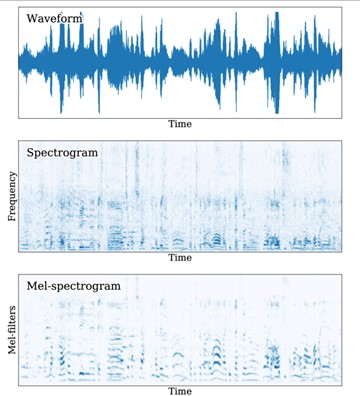
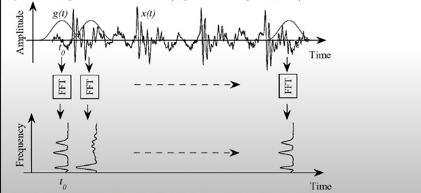
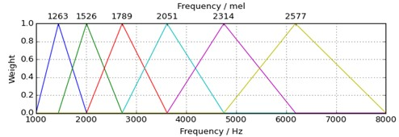
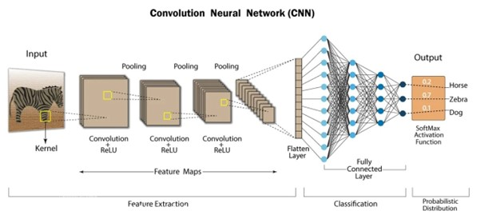
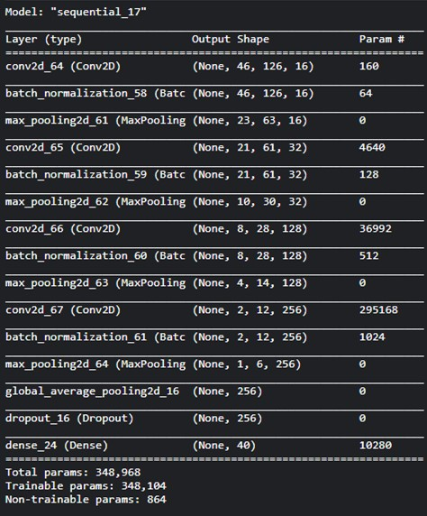
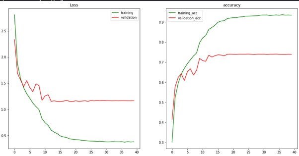

# Bird Audio Classification

## Table of Contents
- [Abstract](#abstract)
- [Techniques Used](#techniques-used)
  - [Mel-frequency Spectrogram](#mel-frequency-spectrogram)
  - [Convolutional Neural Network](#convolutional-neural-network)
- [Dataset](#dataset)
- [Architecture](#architecture)
- [Results](#results)
- [References](#references)
- [Mentors](#mentors)

## Abstract
This project aimed to develop a deep learning model for classifying different species of birds based on audio recordings of their vocalizations. The dataset was obtained from the Kaggle Bird CLEF competition and pre-processed to filter out low-quality audio samples and ensure a sufficient number of samples per bird species. The `librosa` library was used to extract log mel-spectrogram image representations from the audio files. These 2D spectrograms, which encode the time-frequency patterns of the bird vocalizations, were then normalized. The normalized spectrogram images served as input to a convolutional neural network (CNN) model built using the TensorFlow framework. After training for multiple epochs, the validation accuracy was about 74% and the validation F1 score was 73%; the trained CNN demonstrates the feasibility of using deep learning on audio spectrograms for acoustic bird species classification. Potential improvements could involve data augmentation, regularization, and ensemble methods to better generalize the model's performance across diverse recording conditions.

## Techniques Used

### Mel-frequency Spectrogram
A Mel-frequency spectrogram is a representation of the spectrum of a signal as it varies over time. It is derived from the traditional spectrogram, which displays the frequency content of a signal over time. However, instead of linearly spaced frequency bins, the mel spectrogram uses frequency bins that are spaced according to the mel scale, which is a perceptual scale of pitches based on human hearing. This scaling is designed to better represent how humans perceive differences in pitch.

**Steps to get the Mel spectrogram:**
1. The Short Time Fourier Transform is calculated, and the amplitude is converted to decibels.

2. Convert frequencies to the Mel scale.
3. Choose the number of mel bands and construct mel filter banks, which are then applied to the spectrogram.

### Convolutional Neural Network
CNNs, or Convolutional Neural Networks, are deep learning architectures particularly effective for image processing tasks. They consist of layers that apply convolution operations to capture features like edges and textures, pooling layers to reduce spatial dimensions, activation functions for non-linearity, and fully connected layers for classification or regression. CNNs excel at automatically learning hierarchical representations from raw data, making them invaluable for tasks such as image classification, object detection, and segmentation, where they have achieved state-of-the-art performance.

## Dataset
The dataset consists of 40 bird species. The goal is to extract mel spectrograms from the audio recordings and pass them to the CNN.

## Architecture
The convolutional neural network has the following structure:
- 4 blocks, each consisting of:
  - Convolutional layer
  - Batch normalization
  - Max pooling
- Followed by:
  - Global average pooling
  - Dropout
  - Final classification dense layer

## Results
The validation F1 score did not improve from 0.73505. The validation accuracy (74%) is significantly less than the training accuracy, indicating overfitting. For improvement, the dataset needs thorough pre-processing, data augmentation, and more hyperparameter tuning.

    
## References
- [Intuitive Understanding of MFCCs](https://medium.com/@derutycsl/intuitive-understanding-of-mfccs-836d36a1f779)
- [Mel Spectrogram Explained Easily](https://github.com/musikalkemist/AudioSignalProcessingForML/tree/master/17%20-%20Mel%20Spectrogram%20Explained%20Easily)

## Mentors
- Aryan N Herur
- Vaibhav Santhosh
